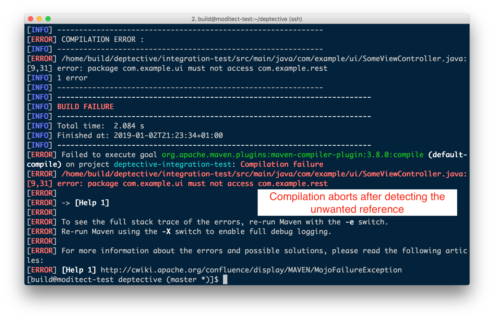
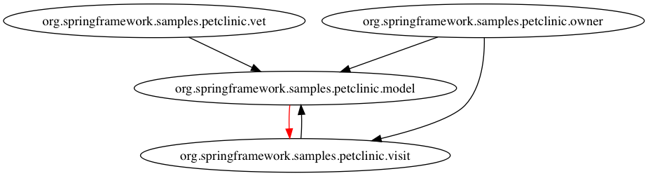

# Deptective

[](https://travis-ci.org/moditect/deptective) [](https://jitpack.io/#moditect/deptective)

🕵️ Deptective is a plug-in for the Java compiler (_javac_) that validates the dependencies
amongst a project's packages against a description of allowed dependences
and fails the compilation when detecting any unintentional dependencies.

* [Why Deptective?](#why-deptective)
* [Requirements](#requirements)
* [Usage](#usage)
   * [Structure of <em>deptective.json</em>](#structure-of-deptectivejson)
   * [Configuring the Java compiler](#configuring-the-java-compiler)
      * [Apache Maven](#apache-maven)
      * [Gradle](#gradle)
   * [Configuration Options](#configuration-options)
   * [Obtaining Deptective via Jitpack](#obtaining-deptective-via-jitpack)
* [Contributing and Development](#contributing-and-development)
   * [IDE Set-Up](#ide-set-up)
* [Related Work](#related-work)
* [License](#license)

## Why Deptective?

🕵 In order to implement comprehensible and maintainable software systems, a well-defined structure between their components is needed.
While module systems (multi-module builds, the Java Module System, OSGi etc.) are proven means of structuring large code bases,
software structure should also be defined and enforced at a lower level, i.e. within individual modules and by defining which APIs should be accessed across module boundaries.

Deptective helps with this task by allowing you to define a software system's structure in terms of intended package relationships (e.g. `com.example.service` may read `com.example.persistence`, but not the other way around)
and enforcing these relationships at compile time.
Implemented as a plug-in for the _javac_ compiler, Deptective will abort the compilation when detecting unwanted package dependencies, allowing you to fix the issue at the earliest time possible.
Compared to traditional architecture monitoring tools (that for instance run once nightly on a CI server and whose reports are easy to ignore), hooking right into the compiler itself allows for very fast feedback cycles.
The overhead is very low, e.g. less than 1 sec for a medium-sized code base such as Hibernate Validator (740 classes).

The following shows an example when using Deptective via Maven:



Optionally, you also can visualize the package relationships via GraphViz, highlighting any unwanted relationships.
The following shows an example from the [Spring PetClinic](https://github.com/moditect/deptective-spring-petclinic-example) sample application, which has been modified to have an undesired reference from the `model` to the `visit` package:



## Requirements

🕵 JDK 8 or later is needed to run Deptective.

The plug-in is specific to _javac_, i.e. the compiler coming with the JDK, it does not work with other compilers such as the _Eclipse Batch Compiler_ (_ecj_).
Support for _ecj_ may be added [later on](https://github.com/moditect/deptective/issues/2).

Deptective can be used with any Java build system such as Maven, Gradle etc.

## Usage

🕵 Deptective is configured through a file _deptective.json_ which describes the allowed dependencies amongst the project's packages.

### Structure of _deptective.json_

🕵 The _deptective.json_ file is structured like this:

```
{
    "components" : [
        {
            "name" : "ui",
            "contains" : [ "com.example.ui" ],
            "reads" : [
                "persistence",
                "service"
            ]
        },
        {
            "name" : "persistence",
            "contains" : [ "com.example.persistence" ]
        },
        {
            "name" : "service",
            "contains" : [ "com.example.service" ],
            "reads" : [
                "persistence"
            ]
        },
        {
            "name" : "rest",
            "contains" : [ "com.example.rest" ],
            "reads" : [
                "persistence",
                "service"
            ]
        }
    ],
    "whitelisted" : [
        "java.io*",
        "java.util*"
    ]
}
```

`components` is a list of `Component` objects.
The `Component` object has the following properties:
* `name`: a logical name of the component
* `contains`: a list of packages contained in the component (the `*` character can be used as a wildcard)
* `reads`: list of other components that may be accessed by this component

`whitelisted` is a list of strings representing whitelisted packages,
i.e. packages that always can be read by any other component.
The `*` character can be used as a wildcard, so e.g. `java.util*` will whitelist the packages `java.util`, `java.util.concurrent` etc.

_Note:_ access to the package `java.lang` is always allowed.

Place the configuration file in the root of your source directory (e.g. _src/main/java_ for Maven projects)
or on the classpath at _META-INF/deptective.json_ (e.g. _META-INF/src/main/resources/deptective.json_ for Maven projects).
Alternatively you can specify the location of the config file using the `configfile` option (see below).

### Configuring the Java compiler

🕵 In order to use Deptective, add _deptective-javac-plugin-1.0-SNAPSHOT.jar_ to your project's annotation processor path and specify the option `-Xplugin:Deptective` when invoking _javac_.

#### Apache Maven

🕵 When using Maven, add the following configuration to your _pom.xml_:

```
...
<build>
    <plugins>
        <plugin>
            <artifactId>maven-compiler-plugin</artifactId>
            <configuration>
                <showWarnings>true</showWarnings>
                <compilerArgs>
                    <!-- add further options as needed -->
                    <arg>-Xplugin:Deptective reportingpolicy=WARN</arg>
                </compilerArgs>
                <annotationProcessorPaths>
                    <path>
                        <groupId>org.moditect.deptective</groupId>
                        <artifactId>deptective-javac-plugin</artifactId>
                        <version>1.0-SNAPSHOT</version>
                    </path>
                </annotationProcessorPaths>
            </configuration>
        </plugin>
    </plugins>
</build>
...
```

See [integration-test/pom.xml](integration-test/pom.xml) for a complete example.

#### Gradle

🕵 When using Gradle, add the following configuration to your _build.gradle_:

```
...
dependencies {
    annotationProcessor 'org.moditect.deptective:deptective-javac-plugin:1.0-SNAPSHOT'
}

tasks.withType(JavaCompile) {
    options.compilerArgs = [
            'Xplugin:Deptective' +
            'mode=VALIDATE' +
            'reporting_policy=ERROR' +
            'visualize=true' +
            "config_file=${projectDir}/src/main/resources/META-INF/deptective.json"
    ]
}
...
```

See [integration-test/build.gradle](integration-test/build.gradle) for a complete example.

### Configuration Options

🕵 The following options can be provided when running the plug-in:

* `config_file=path/to/deptective.json`: Path of the configuration file in the file system
* `reporting_policy=(ERROR|WARN)`: Whether to fail the build or just raise a warning when spotting any illegal package dependencies (defaults to `ERROR`; make sure to set `<showWarnings>` to `true` when using the plug-in via Maven)
* `unconfigured_package_reporting_policy=(ERROR|WARN)`: Whether to fail the build or just raise a warning when detecting a package that's not configured in the config file (defaults to `WARN`)
* `mode=(ANALYZE|VALIDATE)`: Whether the plug-in should validate the packages of the compiled package against the _deptective.json_ file (`VALIDATE`) or whether it should generate a template for that file based on the current actual package relationships (`ANALYZE`).
The latter can be useful when introducing Deptective into an existing code base where writing the configuration from scratch might be too tedious. Generating the configuration from the current "is" state and iteratively refining it into an intended target state can be a useful approach in that case.
The generated JSON file is created in the compiler's source output path, e.g. _target/generated-sources_ in case of Maven. Defaults to `VALIDATE`
* `whitelisted=...`: An optional comma-separated list of whitelist package patterns which will be applied in `ANALYZE` mode. Any reference to a whitelisted package will then not be added to the `reads` section of the referencing package in the generated descriptor template.
The special value `*ALL_EXTERNAL*` can be used to automatically whitelist all packages which are not part of the current compilation (i.e. packages from dependencies). This can be useful if you're only interested in managing the relationships amongst the current project's packages themselves but not the relationships to external packages.
* `components=...`: A optional semicolon-separated list of component definitions which will be applied in `ANALYZE` mode.
This is helpful when creating the Deptective configuration for an existing code base,
where examining relationships on the package level would be too detailed otherwise.
Component definitions are given in the form "<name>:<package pattern 1>, <package pattern 2>, ...".
Any package matching a component will not be added by itself to the generate configuration but to the `contains` section of the matching component.
Example value: "foo:com.example.foo1,com.example.foo2;bar:com.example.bar*;qux:com.example.qux".
* `visualize=(true|false)`: Whether to create a GraphViz (DOT) file representing generated configuration template (in `ANALYZE` mode) or the dependency configuration and (if present) any illegal package dependencies (in `VALIDATE` mode).
The generated DOT file is created in the compiler's source output path, e.g. _target/generated-sources_ in case of Maven.
Defaults to `false`.
Illegal component relationships will be marked in red, and relationships that are part of a cycle amongst multiple components are marked in purple.
* `cycle_reporting_policy=(ERROR|WARN)`: Whether detected circular dependencies between components ("cycles") should fail the build (`ERROR`) or only should cause a warning (`WARN`).
When using the `VALIDATE` mode, this check applies to the components defined in the _deptective.json_ file.
As cycles are generally not desirable, the default reporting policy is `ERROR` in this mode,
and you should adjust the architecture model to break up any cycles
(any cycles in the *actual* code base would still be reported as an unintended component relationship of course).
When using the `ANALYZE` mode, this check applies to the actual dependencies of the components of the analysed code base.
The default reporting policy is `WARN` in this case.
Before validating the code base against the architecture model, it should be adjusted to break up any cycles.

### Obtaining Deptective via Jitpack

🕵 Deptective is not yet available in Maven Central.
For the time being, you can obtain the latest snapshot JARs via [Jitpack](https://jitpack.io/).
Add the following repository to your project's _pom.xml_ or your Maven _settings.xml_ file:

```
<repositories>
    <repository>
        <id>jitpack</id>
        <name>Jitpack</name>
        <url>https://jitpack.io</url>
    </repository>
</repositories>
```

Then reference the Deptective JAR using the GAV coordinates `com.github.moditect.deptective:deptective-javac-plugin:master-SNAPSHOT`.

See [jitpack-example/pom.xml](jitpack-example/pom.xml) for a complete example.

For Gradle, add the repo like this:

```
allprojects {
    repositories {
        ...
        maven { url 'https://jitpack.io' }
    }
}
```

## Contributing and Development

🕵 In order to build Deptective, [OpenJDK 11](https://openjdk.java.net/projects/jdk/11/) or later and Apache Maven 3.x must be installed.
Then obtain the source code from GitHub and build it like so:

```
git clone https://github.com/moditect/deptective.git
cd deptective
mvn clean install
```

Your contributions to Deptective in form of [pull requests](https://help.github.com/articles/about-pull-requests/) are very welcomed.
Before working on larger changes, it's recommended to get in touch first to make sure there's agreement on the feature and design.

### IDE Set-Up

🕵 To work on the code base in Eclipse, please follow this steps:

1. Run Eclipse with (at least) Version 2018-12/4.10.0 and make sure it runs with OpenJDK 11
2. In Eclipse, register an OpenJDK 11 instance ("Preferences" -> "Java" -> "Installed JREs") if not already there
3. Then run "File" -> "Import..." -> "Maven" -> "Existing Maven Projects" and select the root folder of this repository.
4. After importing the project, make sure that Java 11 is on the build path of the _javac-plugin_ module
(right-click on that module, then "Properties" -> "Java Build Path" -> "Libraries").

### Code Style

Please import the Eclipse formatter configuration from [etc/eclipse-formatter.xml](etc/eclipse-formatter.xml) and enable it when working on the project.
Run `mvn spotless:format` to apply the formatter automatically.

Also enable the following "Save Actions":

* Organize imports
* Add final modifier to private fields
* Add missing `@Override` annotations
* Add missing `@Override` annotations to implementations of interface methods
* Add missing `@Deprecated` annotations
* Remove unnecessary casts
* Remove trailing white spaces on all lines

## Related Work

🕵 Different projects exist that analyze Java package dependencies, validate and/or produce metrics on them.
I'm not aware of any tool though that provides instantaneous feedback about any unwanted dependencies right during compilation.
Some related tools are:

* [ArchUnit](https://www.archunit.org/) aims at enforcing architectures described in a Java DSL.
In contrast to Deptective it is not executed during compilation but via (JUnit) tests.
* [JDepend](https://github.com/clarkware/jdepend) analyzes Java packages and produces metrics on them.
* The Eclipse Java compiler allows to put access restrictions in place but they can only be used to limit access to types/packages in other JARs on the classpath, not to packages of the current compilation unit itself
* [code-assert](https://github.com/nidi3/code-assert) allows to enforce dependency rules described in a Java DSL.
Similarly to ArchUnit, these rules are executed as unit tests.
* [Macker](https://innig.net/macker/) enforces architectural rules at build time via dedicated build tool plug-ins. (not actively maintained)

## License

🕵 Deptective is licensed under the Apache License version 2.0.
